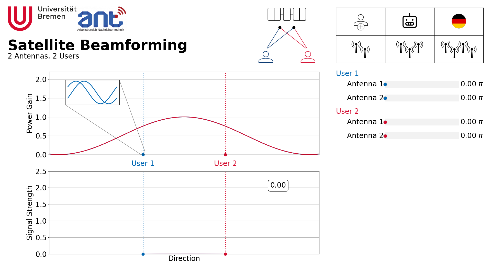

# Satellite Downlink Beamforming Demo

We can form transmission beams by manipulating the phase of a precoding for every antenna-user-link.
Number of antennas and users can be varied.
Pre-calculated "AI solutions" exist for every scenario. Note: These are approximations, not the optimum solution.

The relevant file to start the GUI demo is `src/gui.py`.  
To use our templates, rename the `.py.default` files under `src/config/` to end in the normal `.py`.



### How does it work?

- The upper window shows the power gain of the superimposed antenna emissions per user.
- For the leftmost user only, the inset window shows the phase of each individual antenna emission.
- The phases can be controlled by the sliders on the right hand side.
- At any position, constructive interference of the antennas will lead to high directional gain, while destructive interference leads to low gain.
- To maximize the sum rate, we want to maximize each user's power gain at their position, while minimizing each user's power gain at all other user's positions.
- The lower window shows the effect of the overlapping gains. High power gain and low inter-user interference lead to high sum rates.
- The number in the lower window shows the sum rate, ignoring values lower 0.

```
root
|   .gitignore            | .gitignore
|   README.md             | this file
|   requirements.txt      | project dependencies
|           
+---reports               | related material
+---src                   | code
|   +---config            |   configuration files
|   +---models            |   learning related
|   +---satellite_figures |   tikz code to generate figures
|   +---images            |   gui images

```

## Quickstart
This project uses `python3.11`

### Ubuntu / Linux
Under Ubuntu you can simply run the `init.sh` file, it will:
- add the deadsnakes/ppa to your system
- perform an apt update
- apt install 
- - software-properties-common
- - python3.11 python3.11-venv python3.11-pip

And then download and install the necessary python libraries into a virtual environment.

To start the demo, you can run the `start.sh`, it will:
- check wether you created your own `src/config/config*.py` files. If not, it will copy our templates and remove the `.default` label.
- activate the venv created by `init.sh`
- run the `src/gui.py`

### Windows

At the moment the Windows and Linux dependencies differ.  
To run under windows, please update the following libraries to these version (last checked 6th, December 2024):

- tensorflow==2.15.0
- tentensorflow-io-gcs-filesystem==0.31.0   

reason:
- [io-gcs: no wheel file for windows](https://github.com/tensorflow/tensorflow/issues/79581)
- [tensorflow: no wheel for windows](https://blog.tensorflow.org/2023/11/whats-new-in-tensorflow-2-15.html)


Windows doesnt support `float128` at the moment, please update line 16 of `src/utils/spherical_to_cartesian_coordinates.py` to use `float64` instead of `float128`. 
